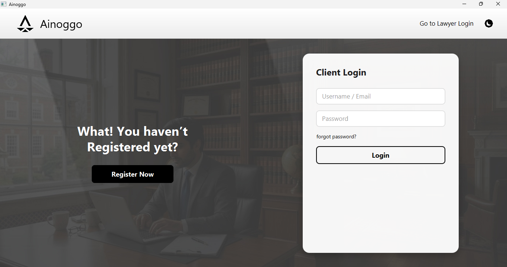
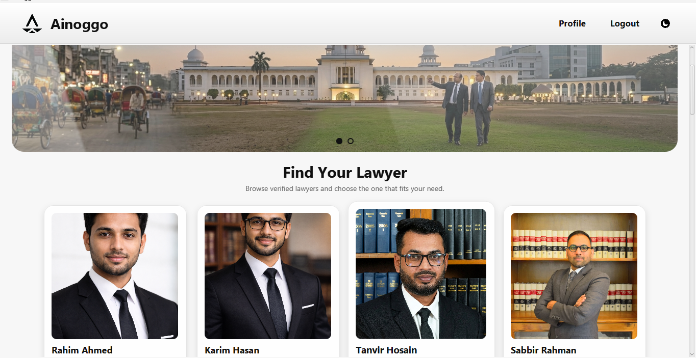
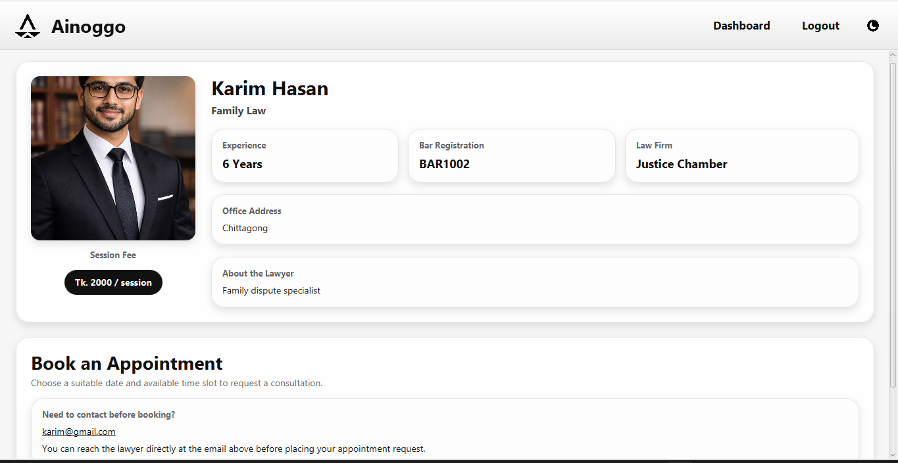
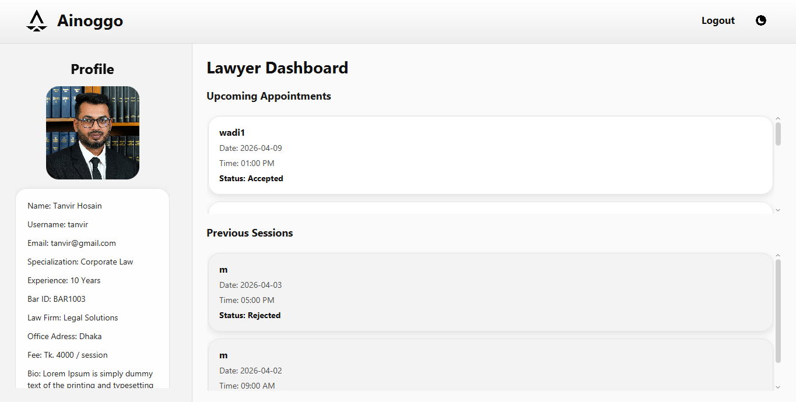

# ⚖️ Ainoggo

A JavaFX-based law and appointment management system.

---

## 🚀 Features

* 👨‍⚖️ Lawyer profiles
* 📅 Appointment booking system
* 👤 User dashboard
* 🔐 Login & Registration
* 📸 Image upload support

---

## 🛠️ Technologies Used

* Java
* JavaFX
* MySQL
* CSS

---

## 📂 Project Structure

* src/ → Source code
* lib/ → Libraries
* uploaded_photos/ → Images

---

## 👥 Team Members

* Most:Moriom Sultana
* Abu Ubida Wadi

---

## 🎓 Supervisor

* Md. Emamul Haque Pranta(Lecturer,BUET)

---
▶️  How to Run

1.Clone the repository:
git clone https://github.com/abuubidawadi/Ainoggo.git

2.Open in IDE (IntelliJ / VS Code)

3.Run the project
## 📸  Some Screenshots

### Login Page

### UserDashboard

### Book Appointment

### LawyerDashboard

## 🎥 Demo Video

[Watch Demo](https://youtu.be/3wfJSzklKco?si=kgcBmQGBS9f3HNfI)
